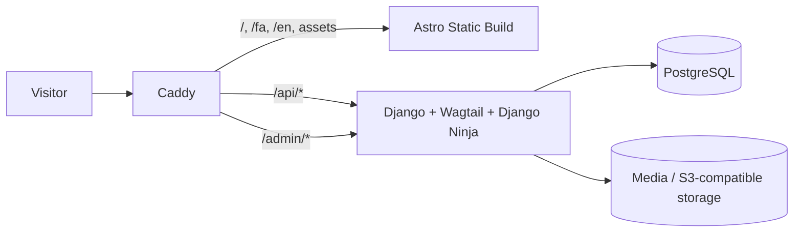
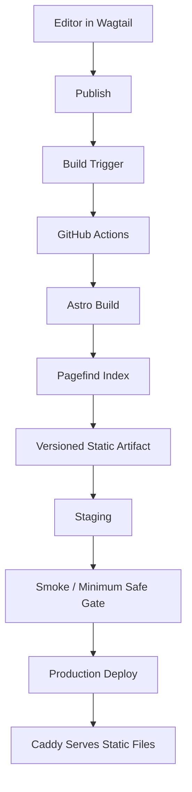
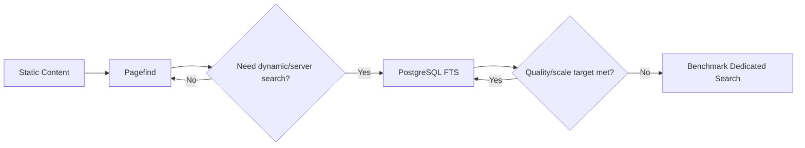
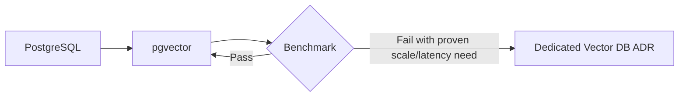
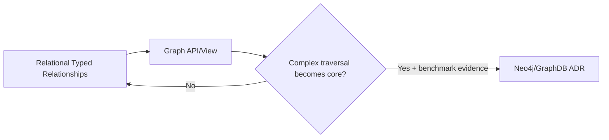

# معماری فنی و Technology Stack سایت شخصی طه محمدی

## Technology & Architecture Baseline v1.0 — 2026-08-13

> **وضعیت سند:** Proposed-to-Freeze Technology Baseline  
> **محصول:** Personal Research, Professional & Knowledge Platform  
> **اسناد بالادستی:**  
> - `طرح نهایی سایت شخصی طه محمدی.md` — Product Baseline  
> - `taha-personal-platform-development-master-plan-fa.md` — Development Master Plan  
> - `docs/governance/RELEASE_POLICY.md` — Release Policy  
>
> **مخاطب این سند:** صاحب پروژه، Codex، Cursor و سایر agentهای توسعه.
>
> این سند فقط فهرست ابزار نیست؛ قرارداد معماری فناوری است. Agent حق ندارد فناوری جایگزین، سرویس جدید، dependency زیرساختی، database جدید، queue، cache، search engine، vector database یا معماری deployment جدید را بدون Trigger تعریف‌شده و ADR پذیرفته‌شده وارد پروژه کند.

---

# 1. اهداف معماری

معماری باید هم‌زمان این اهداف را برآورده کند:

1. **Time-to-Live بسیار پایین**
   - Landing باید بدون منتظر ماندن برای Backend/CMS کامل قابل انتشار باشد.
   - P1 و P2 نباید بی‌دلیل به database persistence وابسته شوند.

2. **سرعت لود بسیار بالا روی VPS ضعیف**
   - Public Website تا حد ممکن static باشد.
   - HTML اصلی نباید برای هر request توسط application server تولید شود.
   - JavaScript فقط جایی ارسال شود که interaction واقعی لازم است.

3. **UI/UX سطح بالا بدون قربانی‌کردن Performance**
   - استفاده از اکوسیستم React برای componentها و interactionهای آماده.
   - انیمیشن و visual effect انتخابی و lazy.
   - Progressive Enhancement الزامی.

4. **CMS حرفه‌ای بدون ساختن CMS از صفر**
   - Blog، Research، Projects، Publications، Books، Teaching، Creative، Resume و Page Composition باید با Content Model ساختاریافته قابل مدیریت باشند.

5. **دوزبانگی فارسی/انگلیسی از معماری**
   - `fa` و `en` First-class هستند.
   - RTL/LTR و mixed content الزامی است.
   - ترجمه‌ها مستقل ولی مرتبط‌اند.

6. **Agent-friendly**
   - قرارداد API typed.
   - Schemaهای صریح.
   - ساختار repository واضح.
   - ابزارها و commandها در `PROJECT_MANIFEST.md` Pin شوند.
   - Agent نباید response shape یا model boundary را حدس بزند.

7. **Progressive Complexity**
   - Redis، Celery، OpenSearch، Neo4j، Vector DB مستقل، Kubernetes و Microservices تا قبل از Trigger واقعی وارد Runtime نمی‌شوند.

8. **قابلیت رشد**
   - Architecture فعلی نباید راه Search پیشرفته، Knowledge Graph، Semantic Retrieval و AI آینده را ببندد.

---

# 2. تصمیم نهایی High-Level

```text
PUBLIC FRONTEND
├── Astro
├── TypeScript
├── React Islands
├── Tailwind CSS
├── Custom Design System
├── shadcn/ui
├── Radix Primitives
├── Lucide Icons
├── Motion
├── GSAP — selective
├── D3 — selective
├── Three.js / React Three Fiber — very selective
├── View Transitions — selective
└── Progressive Enhancement + Reduced Motion

BACKEND / CMS
├── Python
├── Django
├── Wagtail
└── Django Ninja

DATA
├── PostgreSQL
├── PostgreSQL relational model
├── PostgreSQL JSONB — only where appropriate
├── Pagefind — first public static search
├── PostgreSQL Full-Text Search — when server-side search is justified
├── PostgreSQL relationship model — first Knowledge Graph representation
└── pgvector — first semantic/vector option in P11

INFRASTRUCTURE
├── Linux VPS
├── Docker
├── Docker Compose
├── Caddy
└── External/off-server backups

SOURCE CONTROL / CI
├── GitHub
└── GitHub Actions
    └── standard hosted runners for the public repository

INITIALLY NOT USED
├── Redis
├── Celery / dedicated queue
├── Elasticsearch / OpenSearch
├── Neo4j / dedicated GraphDB
├── separate Vector Database
├── Kubernetes
├── Microservices
└── public-user authentication system
```

---

# 3. اصل مرکزی Frontend

## 3.1 Astro، Shell اصلی Public Website است

Public Website یک React SPA نیست.

قاعده:

```text
Static by default.
Interactive only by explicit decision.
```

Astro مسئول:

- Routeها
- Layoutها
- Static HTML generation
- SEO metadata
- structured content rendering
- bilingual routing
- public page composition
- build-time optimization
- loading React Islands only where required

خواهد بود.

## 3.2 React حذف نمی‌شود

React برای interactive componentها استفاده می‌شود، نه برای render کل سایت.

مثال:

```text
Hero static copy                  → Astro / zero client React
About                             → Astro
Resume                            → Astro
Article body                      → Astro
Research Profile                  → Astro
Publication page                  → Astro

Command Palette                   → React Island
Advanced Search UI                → React Island
Interactive Timeline              → React Island
Knowledge Graph                   → React Island
Advanced Filters                  → React Island
AI / Ask My Work                  → React Island
Complex Data Visualization        → React Island
3D Signature Experience           → React Island
```

## 3.3 Hydration Policy

استفاده از hydration بدون دلیل ممنوع.

ترتیب ترجیح:

```text
No client JS
↓
CSS-only interaction
↓
small vanilla JS
↓
React Island
↓
large visualization/3D island
```

هر Island بزرگ باید دلیل performance داشته باشد.

---

# 4. چرا Astro و نه Next.js؟

## 4.1 Decision Matrix

| معیار | Astro | Next.js | React/Vite SPA | Django Templates |
|---|---:|---:|---:|---:|
| Static-first | 10 | 8 | 3 | 7 |
| JS حداقلی | 10 | 7 | 3 | 9 |
| SEO | 10 | 10 | 6 | 10 |
| React ecosystem | 9.5 | 10 | 10 | 4 |
| VPS ضعیف | 10 | 8* | 8 | 9 |
| Interactive future | 9.5 | 10 | 10 | 6 |
| Content-heavy fit | 10 | 9 | 6 | 9 |
| Build-to-static deployment | 10 | 9 | 8 | 4 |
| AI/Graph UI future | 9.5 | 10 | 10 | 5 |
| Fit نهایی پروژه | **98/100** | 94/100 | 80/100 | 85/100 |

`*` Next.js در Static Export نیز سبک می‌شود، اما وقتی هدف اصلی Static-first است بخشی از مزیت‌های خاص Next عملاً استفاده نمی‌شوند.

## 4.2 دلیل انتخاب

Astro خروجی public را در حالت پایه به HTML/CSS/JS static تبدیل می‌کند.

نتیجه:

- Node.js runtime برای Public Frontend در Production لازم نیست.
- Caddy می‌تواند فایل‌های خروجی را مستقیم serve کند.
- Django فقط برای API/Admin/Dynamic capability درگیر می‌شود.
- Crash یا کندی Backend لزوماً صفحات public buildشده را از دسترس خارج نمی‌کند.
- Public pages کمترین مصرف CPU/RAM را روی VPS دارند.

## 4.3 شرط بازنگری Next.js

Next.js فقط در صورت یکی از موارد زیر دوباره بررسی شود:

- majority سایت از static content به authenticated web application تبدیل شود؛
- نیاز گسترده و دائمی به server rendering در Frontend ایجاد شود؛
- Server Actions یا ecosystem-specific Next capability یک نیاز حیاتی را به‌طور measurable ساده کند؛
- static rebuild model دیگر با publishing workflow سازگار نباشد.

تا قبل از آن، Astro انتخاب مرجع است.

---

# 5. Frontend Technology Stack

## 5.1 Core

```text
Astro
TypeScript
React
Tailwind CSS
```

نسخه دقیق هرکدام در P0-G0 از مستندات رسمی بررسی و در `PROJECT_MANIFEST.md` و lockfile مربوط Pin می‌شود.

استفاده از `latest` شناور در Production ممنوع است.

### وضعیت verifyشدهٔ فعلی — 2026-08-15

| ابزار | وضعیت | مرز استفاده |
|---|---|---|
| `motion` 13.1.0 | در `apps/web` lock شده | بدون import یا client bundle در P1؛ فقط برای island مصوب آینده |
| `gsap` 3.15.0 | در `apps/web` lock شده | فقط narrative motion منتخب و route-local |
| `three` 0.185.1 | در `apps/web` lock شده | فقط تجربهٔ سه‌بعدی معنادار با fallback کامل |
| React / React Three Fiber / D3 | نصب نشده | تنها پس از Task Spec و نیاز مشخص ارزیابی می‌شود |
| Design DNA | skill محلی Codex، خارج از artifact | برای تحلیل/ثبت design DNA؛ نه dependency runtime |
| Beautiful UI / UI8 DNA | artifact محلی یا حق استفادهٔ تأییدشده ندارند | تا `DEFER-0012` هیچ asset یا componentی وارد نمی‌شود |

وجود package در lockfile **اجازهٔ import یا ship کردن آن نیست**. تصمیم استفاده برای
هر interaction در Task Spec مستقل و طبق `PROJECT_MANIFEST.md` ثبت می‌شود.

---

# 6. Design System

Design System یک dependency نیست؛ یک قرارداد است.

## 6.1 Layers

```text
Design Foundations
↓
Semantic Tokens
↓
Accessible Primitives
↓
Reusable Components
↓
Patterns
↓
Page Sections
↓
Pages
```

## 6.2 Tokens

حداقل Tokenها:

```text
color
typography
spacing
size
radius
border
shadow/elevation
z-index
motion-duration
motion-easing
breakpoints
container sizes
```

از valueهای hard-coded پراکنده در componentها اجتناب شود.

## 6.3 Semantic Color

به‌جای:

```text
gray-900
blue-500
```

در سطح component تا حد امکان semantic concept داشته باشیم:

```text
surface-primary
surface-secondary
surface-elevated
text-primary
text-secondary
text-muted
border-subtle
border-strong
accent
accent-hover
success
warning
danger
focus-ring
```

## 6.4 Dark / Light

Dark Mode باید token-based باشد.

Dark mode برای اولین release شرط نیست، اما architecture آن نباید در P1 خراب شود.

---

# 7. Tailwind CSS

Tailwind ابزار implementation Design System است، نه Design System.

قواعد:

- utilityهای Tailwind می‌توانند داخل componentها استفاده شوند؛
- valueهای design مهم باید به token برگردند؛
- classهای تکراری باید به component/pattern منتقل شوند؛
- arbitrary valueهای بدون توجیه محدود شوند؛
- RTL با CSS logical properties و strategy سازگار انجام شود؛
- component نباید به ترکیب تصادفی utilityها در ده‌ها صفحه تکثیر شود.

---

# 8. shadcn/ui + Radix Primitives

## 8.1 نقش

این دو برای سرعت ساخت interactionهای قابل‌اعتماد استفاده می‌شوند.

مناسب برای:

- Button
- Dialog
- Sheet / Drawer
- Tabs
- Accordion
- Tooltip
- Dropdown
- Popover
- Command
- Select
- Combobox
- Form controls
- Toast
- Menu

## 8.2 ممنوعیت

UI سایت نباید ظاهراً clone پیش‌فرض shadcn باشد.

فرآیند:

```text
Radix / accessible primitive
↓
shadcn implementation reference/component
↓
Taha Design System adaptation
↓
Project component
```

---

# 9. Iconography

## انتخاب: Lucide

یک Icon System اصلی داشته باشیم.

ممنوع:

- ترکیب تصادفی چند icon library؛
- icon بدون semantic purpose؛
- icon-only interactive control بدون accessible label.

Tokenهای icon:

```text
size
stroke
alignment
state
semantic usage
```

---

# 10. Motion System

## 10.1 Libraries

```text
Motion
GSAP — selective
CSS animations/transitions
Astro/native View Transitions — selective
```

در وضعیت فعلی، `motion` و `gsap` تنها available هستند و P1 هیچ motion runtime
ندارد. برای یک interaction ابتدا CSS/native بررسی می‌شود؛ اگر کافی نبود، یک
library انتخاب می‌شود. Motion و GSAP به‌طور پیش‌فرض برای یک interaction مشترک
به‌کار نمی‌روند.

## 10.2 اولویت

### Functional Motion

برای:

- dropdown
- modal
- tab
- form state
- disclosure
- command palette
- filter transition

اولویت بالا.

### Narrative Motion

برای:

- Career Journey
- Research Timeline
- Selected Case Study
- storytelling sections

مجاز و انتخابی.

### Decorative Motion

کمترین اولویت.

نباید UX یا Load را خراب کند.

## 10.3 Motion Tokens

```text
duration.instant
duration.fast
duration.normal
duration.expressive

easing.standard
easing.enter
easing.exit
easing.emphasized

distance.xs
distance.sm
distance.md
distance.lg
```

## 10.4 Reduced Motion

تمام motionهای غیرضروری باید در `prefers-reduced-motion` کاهش یا حذف شوند.

محتوا نباید به animation وابسته باشد.

---

# 11. GSAP

GSAP با وجود lock شدن در project، dependency عمومی برای هر component نیست.

موارد مناسب:

- scroll-driven storytelling
- complex timeline
- coordinated multi-element reveal
- signature landing sequence
- research narrative

موارد نامناسب:

- button hover
- tooltip
- accordion
- dropdown
- modal ساده

این موارد با CSS/Motion انجام شوند.

GSAP باید lazy-loaded شود اگر فقط در route خاص استفاده می‌شود.

---

# 12. D3

D3 برای visualizationهای سفارشی استفاده می‌شود.

نمونه‌ها:

- Research Map
- Career Journey
- Topic Relationship
- Project Technology Graph
- Timeline
- Evidence network
- interactive data stories

برای chart ساده، قبل از ساخت custom D3 بررسی شود که آیا HTML/CSS/SVG ساده کافی است.

D3 visualization باید:

- keyboard/text fallback داشته باشد؛
- description متنی داشته باشد؛
- در موبایل graceful شود؛
- Reduced Motion را رعایت کند.

---

# 13. Three.js / React Three Fiber

`three` در lockfile موجود است، اما React Three Fiber نصب نشده و P1 هیچ scene یا
WebGL runtime ندارد. نصب R3F فقط همراه با React island مصوب و Task Spec همان
feature ارزیابی می‌شود.

## سیاست

3D یک feature است، نه default style.

حداکثر برای experienceهای امضادار و معنادار.

مناسب:

- یک visualization مفهومی هویت؛
- relationship experience؛
- یک project showcase که ماهیت سه‌بعدی دارد.

نامناسب:

- background سه‌بعدی صرفاً برای شلوغی؛
- 3D در تمام صفحات؛
- blocking Hero render.

هر 3D Feature باید:

```text
lazy load
code split
mobile fallback
static fallback
reduced-motion fallback
performance budget
```

داشته باشد.

همچنین باید user value، route owner، static/text fallback، keyboard path، RTL/LTR
و mobile behavior، اندازهٔ chunk و performance evidence را پیش از release نشان
دهد. 3D تزئینی یا import سراسری پذیرفته نیست.

---

# 14. Progressive Enhancement

اصل:

> JavaScript باید Experience را بهتر کند، نه اینکه محتوای اصلی را قابل دسترس کند.

مثال Knowledge Graph:

بدون JavaScript:

```text
Topic list
Related Research
Related Projects
Related Publications
```

با JavaScript:

```text
Interactive node-link visualization
Filters
Zoom
Focus
Exploration
```

Public content باید در HTML موجود باشد.

---

# 15. View Transitions

استفاده انتخابی برای continuity بین:

- Homepage → Project
- Research → Research Area
- Project card → Project detail
- Article list → Article

ممنوع:

- transition طولانی؛
- animation که navigation را منتظر بگذارد؛
- transition بدون Reduced Motion fallback.

---

# 16. Typography Architecture

Typography یکی از ارکان اصلی Visual Identity است.

## 16.1 English

Roleها:

```text
Display
Heading
Subheading
Body
Small
Caption
Metadata
Citation
Mono
```

## 16.2 Persian

همان roleها باید مستقل tune شوند.

نباید فرض شود metricهای فونت فارسی و انگلیسی برابرند.

## 16.3 Mixed Content

اجباری برای QA:

- فارسی + English technical term
- DOI
- URL
- code
- citation
- year/date
- number
- acronym
- parentheses
- table

## 16.4 Fonts

ترجیح:

- self-hosted
- variable font در صورت مناسب بودن
- subset مناسب
- preload فقط critical font
- fallback stack تعریف‌شده
- جلوگیری از بارگذاری weightهای بی‌استفاده

انتخاب font family در UX/Visual Direction Track انجام می‌شود، نه در این سند.

---

# 17. UI Architecture

## 17.1 Public component layers

```text
src/
├── components/
│   ├── primitives/
│   ├── ui/
│   ├── patterns/
│   ├── sections/
│   ├── islands/
│   └── visualization/
```

### primitives

Low-level:

- Container
- Stack
- Cluster
- Grid
- Text
- Heading
- Link
- Icon
- VisuallyHidden

### ui

- Button
- Card
- Badge
- Tabs
- Accordion
- Dialog
- Tooltip
- FormField

### patterns

- EvidenceCard
- PublicationCard
- ProjectCard
- ResearchAreaCard
- TimelineItem
- RelatedContent
- LanguageSwitcher
- SearchResult

### sections

- Hero
- CurrentFocus
- SelectedEvidence
- Journey
- ResearchOverview
- FeaturedWriting

### islands

Only hydrated React:

- CommandPalette
- SearchExplorer
- InteractiveTimeline
- KnowledgeGraph
- AdvancedFilter
- AskMyWork

---

# 18. State Management

## Baseline

Global state manager در ابتدا استفاده نمی‌شود.

ترتیب:

```text
Astro/static state
↓
React local state
↓
URL state
↓
TanStack Query for server state if needed
↓
small global store only if a proven cross-island need appears
```

### TanStack Query Trigger

فقط زمانی اضافه شود که چند Island نیازمند:

- API caching؛
- background refetch؛
- mutation state؛
- request deduplication؛
- stale/fresh policy

شوند.

### Zustand/Redux Trigger

فقط اگر shared client-state واقعی بین چند subsystem ایجاد شود.

Redux پیش‌فرض ممنوع است.

---

# 19. Forms

## Baseline

- Native semantic form first
- server-side validation mandatory
- frontend validation for UX

### Frontend

`Zod` برای typed validation/config boundary توصیه می‌شود.

`React Hook Form` فقط برای فرم پیچیده‌ای که واقعاً React Island است.

Contact ساده نباید صرفاً برای استفاده از React Hook Form به SPA-like feature تبدیل شود.

### Backend

Django/Django Ninja validation source of truth برای security است.

---

# 20. API Type Safety

این بخش Core Architecture است.

مسیر:

```text
Django typed/domain model
↓
Django Ninja explicit response schema
↓
OpenAPI
↓
generated TypeScript types/client
↓
Astro / React Island
```

Frontend حق ندارد API shape را دستی حدس بزند.

پیشنهاد tool:

```text
openapi-typescript
+
typed fetch client
```

یا generator معادل که در ADR/API tooling Freeze می‌شود.

هر API breaking change نیازمند:

- schema diff؛
- migration/compatibility plan؛
- regenerated client؛
- contract test.

---

# 21. Backend Decision

## انتخاب

```text
Python
Django
Wagtail
Django Ninja
```

---

# 22. Django + Wagtail vs Java Spring Boot

Spring Boot از نظر مهندسی Backend انتخاب بسیار قدرتمندی است.

انتخاب Django به این معنی نیست که Java یا Spring Boot ضعیف‌تر است.

معیار اصلی این پروژه:

> Backend این سیستم در بخش بزرگی Content Management Platform است.

## مقایسه

| معیار | Django + Wagtail | Spring Boot + Custom CMS | Spring Boot + CMS جدا |
|---|---:|---:|---:|
| API engineering | 9 | 10 | 9.5 |
| Admin آماده | 10 | 4 | 9 |
| Editorial workflow | 10 | 3 | 9 |
| Revision/Preview | 10 | 3 | 9 |
| Media | 10 | 4 | 9 |
| Multilingual CMS | 9.5 | 5 | 8 |
| Controlled Page Composition | 10 | 4 | 8 |
| Time-to-Live CMS | 10 | 6 | 7 |
| Custom domain logic | 9.5 | 10 | 9 |
| AI/Python ecosystem | 10 | 8 | 8 |
| تعداد runtime/service | 9 | 9 | 6 |
| Fit کل پروژه | **98** | 88 | 90 |

## دلیل انتخاب Django/Wagtail

نیازهای زیر آماده یا قابل توسعه روی foundation موجود هستند:

- content models
- admin
- media
- permissions
- draft/publish
- revision
- page/snippet management
- localization infrastructure
- editorial operation
- controlled content blocks
- headless usage

ساخت اینها روی Spring Boot به معنی ساختن یک CMS قابل توجه است.

---

# 23. Spring Boot چه زمانی دوباره بررسی شود؟

ADR بازنگری Spring Boot فقط اگر:

1. Backend از CMS-heavy به API/product-heavy تغییر کند؛
2. backend itself قرار باشد engineering showcase اصلی Java باشد؛
3. workload Enterprise integration غالب شود؛
4. نیاز domain-specific به ecosystem Java به‌وجود آید؛
5. Wagtail محدودیت معماری اثبات‌شده ایجاد کند؛
6. benchmark واقعی نشان دهد Backend Django bottleneck غیرقابل‌حل است.

بدون یکی از این Triggerها migration به Spring Boot مجاز نیست.

---

# 24. Wagtail Usage

Wagtail نقش:

```text
CMS
Admin
Editorial Workflow
Media Management
Content Relationships
Multilingual Content
Controlled Page Composition
```

دارد.

Wagtail قرار نیست Public Frontend را render کند.

Public Website = Astro.

---

# 25. Wagtail Page Composition

Baseline:

```text
Structured Content + Controlled Components
```

ممنوع:

- arbitrary HTML page builder؛
- unrestricted CSS editor؛
- Elementor-style unlimited page builder.

Block registry احتمالی:

```text
Hero
RichText
ImageText
Gallery
Video
Timeline
ProjectGrid
PublicationList
Stats
Quote
CTA
Tabs
Accordion
Comparison
Code
Table
Diagram
RelatedContent
TopicExplorer
```

هر Block:

```text
version
schema
validation
allowed pages
accessibility contract
RTL behavior
responsive behavior
preview behavior
```

خواهد داشت.

---

# 26. Headless Publication Flow

Public Astro pageها از CMS داده دریافت می‌کنند.

## Production Strategy

ترجیح:

```text
Wagtail published data
↓
Astro build fetch
↓
Static HTML
↓
Pagefind indexing
↓
Versioned artifact
↓
Caddy
```

این architecture عمداً Public Request را از Backend render جدا می‌کند.

## Publishing/Rebuild

در P3/P4 یک ADR برای Rebuild Trigger لازم است.

اولویت:

1. Manual `Deploy/Rebuild` workflow به‌عنوان fallback قطعی.
2. سپس signed publish-trigger → GitHub Actions.
3. اگر automatic trigger failure داشت، content قبلی سالم می‌ماند و stale-build risk ثبت می‌شود.

Backend نباید publish را موفق اعلام کند ولی failure rebuild را ناپدید کند.

---

# 27. Preview Strategy

Static-first بودن Preview را کمی پیچیده‌تر می‌کند.

بنابراین Preview دو سطح دارد:

### P3 Minimum Preview

- safe CMS preview of content structure؛
- یا staging rebuild مشخص؛
- عدم نیاز به perfect final frontend preview برای اولین CMS release.

### P7 Advanced Preview

- headless preview flow؛
- tokenized preview؛
- frontend-faithful rendering؛
- locale-aware preview؛
- noindex/no-cache.

Advanced preview نباید P1/P2 را block کند.

---

# 28. Django Ninja

Django Ninja boundary API است.

مزایا برای معماری ما:

- schema صریح؛
- OpenAPI؛
- response filtering؛
- typed input/output؛
- مناسب code generation برای Frontend؛
- ساده‌تر شدن Agent reasoning.

قاعده:

```text
Database Model != Public API Schema
```

هر Public Endpoint فقط publishable projection را expose می‌کند.

---

# 29. API Surface

نمونه:

```text
/api/v1/
├── profile
├── experience
├── writing
├── research
├── projects
├── publications
├── books
├── teaching
├── creative
├── topics
├── collections
├── search
└── contact
```

این لیست contract نهایی endpoint نیست.

Endpoint دقیق فقط هنگام فاز مربوطه در OpenAPI/ADR ثبت می‌شود.

---

# 30. Same-Origin API Strategy

برای کاهش CORS complexity:

```text
https://tahamohamadi.ir/        → Caddy static Astro
https://tahamohamadi.ir/api/*   → Caddy → Django
```

ترجیح بر same-origin است.

مزایا:

- CORS ساده‌تر؛
- Cookie/security policy ساده‌تر؛
- Contact API ساده‌تر؛
- public API URL پایدار.

Admin مسیر same-origin مصوب را دارد:

```text
https://tahamohamadi.ir/admin/
```

تصمیم canonical در `ADR-0014` ثبت شده است (`/admin/` به‌عنوان مرز امنیتی).

---

# 31. Backend Runtime

Django Production مستقیماً با development server اجرا نمی‌شود.

Baseline:

```text
Django/Wagtail
↓
Production WSGI/ASGI server
↓
Caddy
```

انتخاب Gunicorn/Uvicorn و worker count در P0 با RAM/CPU واقعی benchmark و Pin می‌شود.

هدف:

- worker count حداقلی؛
- memory control؛
- timeout مشخص؛
- graceful restart.

---

# 32. Database: PostgreSQL

انتخاب اصلی و تنها database اپلیکیشن در Baseline.

---

# 33. چرا PostgreSQL؟

مدل محتوا رابطه‌محور است:

```text
Project ↔ Topic
Project ↔ Publication
Project ↔ Experience
Publication ↔ ResearchArea
Article ↔ Series
Article ↔ Topic
Course ↔ Prerequisite
Course ↔ Skill
Experience ↔ Technology
Collection ↔ Many Entity Types
```

این مسئله relational است.

PostgreSQL مزایای لازم:

- transactions
- relational integrity
- indexes
- constraints
- JSONB
- Full-Text Search
- extensions
- pgvector later

---

# 34. JSONB Policy

JSONB مجاز است، اما جای domain modeling را نمی‌گیرد.

## مناسب برای:

- block configuration؛
- provider-specific metadata؛
- low-query flexible settings؛
- snapshot/provenance payload؛
- optional structured metadata.

## نامناسب برای:

- Project core fields؛
- Publication identity؛
- visibility؛
- locale؛
- permissions؛
- relationships؛
- searchable canonical entities.

قاعده:

> اگر field identity، constraint، query یا relation مهم دارد، ابتدا typed column/relation در نظر گرفته شود.

---

# 35. NoSQL Decision

MongoDB/Couchbase و NoSQL document database در Baseline استفاده نمی‌شوند.

## Trigger بازنگری

فقط اگر workloadی ایجاد شود که:

- document aggregation مستقل غالب باشد؛
- schema variability بسیار بالا و relation پایین باشد؛
- write/read pattern اثبات‌شده با PostgreSQL نامناسب باشد.

صرفاً «flexible schema» دلیل کافی نیست؛ PostgreSQL JSONB وجود دارد.

---

# 36. Search Architecture — اصلاح بهینه برای Static-first

## Stage S0 — Navigation / No Search

P1/P2 Search الزامی نیست.

## Stage S1 — Pagefind

برای Public static corpus انتخاب اول:

```text
Astro build
↓
Static HTML
↓
Pagefind index build
↓
Static search assets
↓
Browser
```

مزایا:

- Search server لازم ندارد؛
- بار query روی VPS ندارد؛
- index همراه artifact deploy می‌شود؛
- فیلتر دارد؛
- locale-aware است؛
- برای `fa` و `en` index جدا بر اساس `lang` تولید می‌کند؛
- مناسب Blog/Research/Projects static output.

### محدودیت

کیفیت stemming فارسی باید با corpus واقعی ارزیابی شود.

Pagefind برای فارسی Search انجام می‌دهد ولی stemming فارسی baseline ندارد؛ بنابراین Test Corpus فارسی الزامی است.

## Stage S2 — PostgreSQL Full-Text Search

وقتی Search نیاز دارد:

- داده هنوز static-build نشده؛
- dynamic relationship-aware results؛
- admin/private search؛
- query analytics سمت server؛
- ranking custom مبتنی بر DB؛
- complex server filters؛
- result از entityهای non-page

داشته باشد.

## Stage S3 — Dedicated Search Engine

فقط در صورت benchmark failure.

Candidateها:

- Meilisearch
- Typesense
- OpenSearch

انتخاب دقیق بعد از benchmark فارسی/انگلیسی.

---

# 37. Search Upgrade Trigger

Dedicated search engine فقط اگر حداقل یکی اثبات شود:

1. Pagefind/Postgres کیفیت typo tolerance لازم را نمی‌دهد؛
2. Persian normalization/ranking به حد هدف نمی‌رسد؛
3. index size/client download نامناسب شود؛
4. faceting پیچیده server-side لازم شود؛
5. query latency target fail شود؛
6. corpus scale از baseline خارج شود؛
7. relevance tuning پیشرفته نیاز شود.

بدون measurement اضافه‌کردن OpenSearch ممنوع است.

---

# 38. Knowledge Graph Data Model

Knowledge Graph لزوماً Graph Database نیست.

Baseline:

```text
Entity A
↓
typed Relationship
↓
Entity B
```

در PostgreSQL.

مثال:

```text
Topic
  ↕
Project
  ↕
Publication
  ↕
ResearchArea
```

Relationship باید تا حد ممکن domain-specific باشد.

از یک `edges` table بسیار generic بدون ADR اجتناب شود اگر typed relation مدل بهتری است.

---

# 39. Neo4j / GraphDB

ابتدا استفاده نمی‌شود.

## Trigger

Neo4j یا GraphDB فقط اگر:

- multi-hop traversal پیچیده workload اصلی شود؛
- path queryها زیاد شوند؛
- graph algorithms core product شوند؛
- PostgreSQL recursive/query model complexity اثبات‌شده ایجاد کند؛
- benchmark latency/maintainability fail شود.

Graph visualization به‌تنهایی Trigger نیست.

D3 می‌تواند داده graph را از PostgreSQL API دریافت کند.

---

# 40. Semantic / Vector Architecture

## Stage V0

No embeddings.

## Stage V1

در P11:

```text
PostgreSQL
+
pgvector
```

اولین گزینه.

مزیت:

- vector کنار metadata/visibility؛
- transaction/relations مشترک؛
- service اضافه کمتر؛
- backup ساده‌تر.

## Stage V2

Vector DB مستقل فقط اگر benchmark واقعی نیاز را اثبات کند.

Candidate در آن زمان evaluate می‌شود؛ از قبل Freeze نمی‌شود.

---

# 41. Vector DB Trigger

Separate Vector DB فقط اگر:

- embedding count/traffic از pgvector capacity تعریف‌شده عبور کند؛
- ANN latency target fail شود؛
- replication/scaling تخصصی vector لازم شود؛
- filtering/vector workload با Postgres bottleneck اثبات‌شده شود؛
- operational benefit بیشتر از هزینه سرویس جدید باشد.

---

# 42. Redis

`NOT USED` در شروع.

## Trigger

Redis زمانی وارد شود که نیاز واقعی به یکی از این موارد ایجاد شود:

- shared/distributed cache؛
- background queue backend؛
- distributed rate limiting؛
- ephemeral high-frequency state؛
- expensive query cache با invalidation روشن؛
- session architecture نیازمند shared store.

Local in-process cache یا HTTP/static cache قبل از Redis بررسی شود.

---

# 43. Celery / Background Jobs

`NOT USED` در شروع.

## Trigger

Queue زمانی لازم می‌شود که request نباید منتظر task بماند:

- mass image processing؛
- embedding generation؛
- scheduled metadata import؛
- newsletter batch؛
- heavy email jobs؛
- large indexing؛
- long-running AI tasks؛
- periodic external sync.

در آن زمان Celery، Dramatiq یا گزینه مناسب benchmark/ADR می‌شود.

Celery از قبل به‌عنوان نتیجه قطعی Freeze نمی‌شود؛ Trigger آن Freeze است.

---

# 44. Microservices

Baseline = **Modular Monolith**.

ساختار منطقی پیشنهادی Backend:

```text
apps/cms/
├── core/
├── identity/
├── experience/
├── writing/
├── research/
├── projects/
├── publications/
├── teaching/
├── creative/
├── taxonomy/
├── search/
├── contact/
└── ai/
```

مرزها منطقی‌اند ولی process/deployment واحد می‌ماند.

## Microservice Trigger

فقط اگر:

- independent scaling واقعی؛
- security isolation؛
- lifecycle مستقل؛
- تیم/ownership مستقل؛
- resource profile بسیار متفاوت؛
- availability boundary

اثبات شود.

«کد زیاد شده» دلیل microservice نیست.

---

# 45. Kubernetes

`NOT USED`.

Docker Compose برای یک VPS و تعداد کم service انتخاب مرجع است.

## Trigger

Kubernetes فقط اگر:

- چند node؛
- service count بالا؛
- autoscaling؛
- orchestration پیچیده؛
- HA multi-node؛
- deployment concurrency بالا؛
- نیاز سازمانی Kubernetes

ایجاد شود.

تا قبل از آن ممنوع.

---

# 46. Media Architecture

## P1/P2

Static curated assets همراه Frontend.

## P3+

CMS media از Wagtail.

ترجیح production:

```text
S3-compatible Object Storage
```

به‌ویژه برای:

- Photography
- Project screenshots
- Books/PDF
- Video thumbnail
- downloadable documents

Provider در P0/P3 بر اساس هزینه/موقعیت/سرویس انتخاب می‌شود.

## Image Rules

- responsive sizes؛
- WebP/AVIF where supported/tooling-approved؛
- width/height معلوم؛
- lazy load non-critical؛
- Hero critical image preload فقط اگر measurement تأیید کند؛
- alt metadata؛
- crop/focal point؛
- no original giant image delivery.

---

# 47. Astro Image vs Wagtail Renditions

دو source داریم:

### Static Frontend Asset

Astro build-time image tooling.

### CMS Asset

Wagtail rendition/media pipeline.

Frontend نباید یک CMS original image بسیار بزرگ را مستقیم مصرف کند.

API باید rendition/size مناسب ارائه کند یا build pipeline آن را بهینه کند.

---

# 48. Code Highlighting

برای Writing/Technical Content:

`Shiki` یا integration استاندارد Astro انتخاب توصیه‌شده است.

Client-side heavy syntax highlighter برای static article لازم نیست.

Highlighting ترجیحاً build-time.

---

# 49. Search UI / Command Palette

UX توصیه‌شده:

```text
Cmd/Ctrl + K
↓
Command/Search Overlay
↓
Research
Projects
Writing
Publications
Resume
Contact
```

در مراحل اولیه:

Pagefind.

در مراحل بعد:

Backend Search / Semantic Search می‌تواند همان UI را بدون تغییر Information Architecture تغذیه کند.

Search UI component باید provider-agnostic باشد.

---

# 50. Component Documentation

## Storybook

Dev-only و پیشنهادی، نه P1 Release Blocker.

Trigger:

- component library رشد کند؛
- بیش از چند pattern مشترک؛
- Agentها component behavior را مرتباً اشتباه کنند؛
- visual states زیاد شوند.

در Design System Hardening اضافه شود.

Production bundle نباید Storybook را شامل شود.

---

# 51. Visual Regression

Baseline:

- Playwright screenshot برای critical page/component.

Visual regression گسترده:

- P1 first live blocker نیست؛
- پس از تثبیت visual baseline فعال شود؛
- در `deferred-validation.md` track شود.

---

# 52. Accessibility Tooling

Recommended dev/test:

```text
semantic HTML
keyboard manual smoke
axe-core / Playwright accessibility checks where useful
screen-reader targeted QA
```

Automated accessibility جای manual testing را نمی‌گیرد.

Minimum Safe Gate طبق Release Policy اعمال می‌شود.

---

# 53. Frontend Testing

```text
Vitest
React Testing Library
Playwright
```

قاعده Risk-based:

- static visual copy → build/render/smoke
- complex React logic → unit/component
- critical journey → Playwright
- Search → integration against built index/API
- auth/admin → Backend/E2E deeper coverage

---

# 54. Backend Tooling

Baseline پیشنهادی:

```text
pytest
pytest-django
Ruff
type checking — mypy/django-stubs or approved equivalent
```

نوع دقیق type checker در P0-G0 Freeze شود.

---

# 55. Python Package Management

پیشنهاد:

```text
uv
pyproject.toml
uv.lock
```

هدف:

- reproducible install؛
- lockfile؛
- سریع‌تر شدن agent/dev bootstrap؛
- commandهای canonical.

---

# 56. JavaScript Package Management

پیشنهاد:

```text
pnpm
package.json
pnpm-lock.yaml
```

Workspace فقط وقتی واقعاً چند package داخلی داریم.

---

# 57. Dependency Policy

با توجه به هدف پروژه، **تعداد dependency به‌خودی‌خود معیار منفی نیست**.

اما هر dependency باید یک مسئله واقعی را حل کند.

معیار پذیرش:

```text
Utility
Maintenance
Security
Bundle impact
Runtime impact
Accessibility
DX/Agent DX
License
Replacement cost
```

Dependency Dev-only که production runtime را سنگین نمی‌کند آزادانه‌تر ارزیابی می‌شود.

Dependency client-side باید سخت‌گیرانه‌تر باشد.

---

# 58. Client Bundle Policy

هر library با این طبقه‌بندی:

```text
build-only
server-only
shared
client-critical
client-lazy
route-only
```

ثبت شود.

GSAP، D3، Three/R3F:

```text
client-lazy / route-only
```

و نباید global bundle شوند.

---

# 59. Performance Philosophy

هدف:

> Fast by architecture, not by late optimization.

قواعد:

1. Static HTML default.
2. Zero-JS component preferred.
3. React Island only by requirement.
4. Large libraries lazy.
5. Images aggressively sized.
6. Font budget.
7. Caddy static serving.
8. Cache immutable hashed assets.
9. Avoid runtime frontend server.
10. Backend not in critical path of prebuilt page delivery.

---

# 60. Performance Budgets

عدد نهایی بعد از اندازه VPS و baseline Lighthouse/real test Freeze شود.

اما categoryها از ابتدا:

```text
HTML size
critical CSS
initial JS
largest route-specific JS
font transfer
hero image
LCP
CLS
INP
server API p95
```

Budget breach:

- P1: non-critical مورد می‌تواند defer شود اگر UX واضح خراب نیست؛
- بعد از baseline: regression باید evidence و Risk ID داشته باشد.

---

# 61. Caching

## Level 1 — Browser/HTTP

اولین انتخاب.

Static hashed assets:

```text
long immutable cache
```

HTML:

```text
shorter/revalidation policy
```

## Level 2 — Caddy

static serving/compression/header/cache strategy.

## Level 3 — Application Cache

فقط اگر profiling نشان دهد.

## Level 4 — Redis

فقط Trigger-defined.

---

# 62. Infrastructure

Baseline:

```text
Docker
Docker Compose
Caddy
```

---

# 63. Production Topology



Public HTML delivery به Django وابسته نیست.

---

# 64. Build / Publishing Topology



Fallback:

Manual rebuild/deploy همیشه باید وجود داشته باشد.

---

# 65. Docker Compose Services

## Early

P1 ممکن است فقط:

```text
caddy
```

برای static output نیاز داشته باشد.

## P3+

```text
caddy
django
postgres
```

GitHub Actions hosted است و service جدیدی در Compose ندارد.

Object storage ممکن است external باشد.

## Not Baseline

```text
redis
celery-worker
opensearch
neo4j
vector-db
kubernetes
```

---

# 66. Caddy

نقش:

- HTTPS termination؛
- automatic certificate management؛
- HTTP→HTTPS؛
- static file serving؛
- reverse proxy `/api` و `/cms`؛
- compression/header policy؛
- access logs.

Caddy config باید version controlled باشد.

---

# 67. GitHub and GitHub Actions

## انتخاب

```text
GitHub public repository
+
GitHub Actions hosted standard runners
```

دلیل:

- remote canonical موجود و public؛
- PR/Issue/Actions یکپارچه؛
- runner و service جدید روی VPS ندارد؛
- GitHub Actions hosted standard برای repository عمومی رایگان است؛
- build از production VPS جدا می‌ماند.

---

# 68. CI resource policy

**Runner self-hosted روی Production VPS اجرا نمی‌شود.**

بهتر:

```text
GitHub Actions hosted runner
↓
Build Artifact/Image
↓
Production VPS
```

دلیل:

Build می‌تواند CPU/RAM زیادی مصرف کند و Public Website را کند کند.

هر نیاز آینده به self-hosted runner باید runner جدا از VPS production، resource budget و ADR جدید داشته باشد.

---

# 69. Reconsideration trigger

GitHub Actions hosted baseline تا زمانی معتبر است که repository عمومی بماند و هزینه/کنترل/latency نیاز متفاوتی اثبات نشود. Gitea، GitLab یا self-hosted runner فقط با ADR، cost model، security review و machine جدا ارزیابی می‌شوند.

---

# 70. Source and CI backup boundary

Git repository history در GitHub نگهداری می‌شود، اما GitHub Actions artifacts backup production نیستند. backup database/media/configuration طبق ADR-0010 روی مقصد off-site رمزنگاری‌شده انجام می‌شود.

---

# 71. CI Pipeline

```text
checkout
↓
manifest/version verification
↓
frontend install
↓
backend install
↓
risk-based lint/typecheck/test
↓
Astro build
↓
Pagefind index
↓
backend build/check
↓
security/dependency scans
↓
artifact/image creation
↓
staging deploy
↓
smoke
↓
owner approval when required
↓
prod deploy
↓
production smoke
```

همه مراحل برای FAST-TRACK الزامی نیستند؛ `RELEASE_POLICY.md` مرجع است.

---

# 72. Deployment Artifact

Deployment باید versioned باشد.

برای Static Frontend:

- versioned tar/artifact یا image؛
- atomic-ish switch/symlink/container deploy؛
- previous artifact retained برای rollback.

Backend:

- versioned image؛
- migration policy additive/compatible.

---

# 73. Security Baseline

- HTTPS
- secret management
- no secrets in frontend
- Django trusted hosts
- secure cookies
- CSRF for session/admin
- server-side authorization
- rate limiting contact/admin-sensitive routes
- upload validation
- MIME/signature
- XSS sanitization
- Wagtail/Django security updates
- dependency scanning
- container least privilege where practical
- database not publicly exposed
- no self-hosted CI runner on the production VPS
- admin MFA

---

# 74. Public Frontend Security

Static Frontend attack surface باید کم بماند.

ممنوع:

- secret در Astro public env؛
- admin token در build artifact؛
- private CMS data داخل static JSON؛
- draft content در Pagefind index؛
- debug/source sensitive payload در production.

Build pipeline باید public projection را enforce کند.

---

# 75. Search Index Security

Pagefind فقط خروجی public HTML را index کند.

نباید index شود:

- draft
- private
- restricted download URL
- internal note
- admin
- preview
- staging-only content

Staging search index باید `noindex` و environment-isolated باشد.

---

# 76. Observability

## P0-A Minimum

- Caddy access/error log
- Django structured log
- health endpoint
- deploy version
- 5xx visibility
- disk usage awareness
- basic uptime check

## P0-B

- central error tracking
- alerting
- metrics
- SLO
- recurring restore drill
- deeper performance monitoring

نباید P1 را بدون Critical/High risk متوقف کند.

---

# 77. Backup

سه دسته:

```text
PostgreSQL
Media
Configuration/Deployment
```

Static Astro artifact قابل rebuild است ولی آخرین working artifact برای rollback نگه داشته شود.

Backup روی همان VPS به تنهایی backup کافی نیست.

---

# 78. Bilingual Architecture

## Frontend

Routes recommendation:

```text
/fa/...
/en/...
```

زبان root redirect/default در UX/IA ADR تعیین می‌شود.

هر page:

```text
lang
dir
canonical
hreflang
locale-specific slug
locale-specific metadata
```

## Backend

Wagtail Locale/translation identity استفاده شود.

ترجمه‌ها مستقل‌اند.

Fallback silent ممنوع.

---

# 79. RTL / LTR

- CSS logical properties
- `dir=rtl` / `dir=ltr`
- component-level mixed direction test
- code blocks LTR where needed
- URLs LTR
- citation mixed-direction test
- tables responsive
- icons directional awareness
- carousel/navigation arrow direction behavior بررسی شود.

---

# 80. Frontend Search Bilingual Behavior

Pagefind index بر اساس `lang` جدا می‌شود.

Baseline:

- Search در `/fa/` ابتدا index فارسی؛
- Search در `/en/` ابتدا index انگلیسی.

Cross-language suggestion UX بعداً در UX Track تصمیم‌گیری شود.

Persian corpus باید test set داشته باشد چون stemming فارسی baseline نیست.

---

# 81. Pagefind → PostgreSQL → Dedicated Search



---

# 82. PostgreSQL → pgvector → Vector DB



---

# 83. PostgreSQL → GraphDB



---

# 84. P0–P11 Technology Adoption Map

## P0

Core:

```text
Astro
TypeScript
Tailwind
Design Tokens baseline
Docker
Docker Compose
Caddy
GitHub Actions hosted
```

Backend skeleton فقط اگر dependency واقعی P0 نیاز دارد.

## P1 Landing

```text
Astro
Tailwind
Design System minimum
Lucide
Motion selective
React Island only if concrete interaction exists
```

Three/D3/GSAP شرط P1 نیستند.

## P2 About / Resume / Contact

```text
Astro
typed static/config content
Django API only for Contact if needed
Zod/frontend form validation as justified
```

CMS persistence برای About/Resume شرط نیست.

## P3 Content Core / Minimal Admin

```text
Django
Wagtail
Django Ninja
PostgreSQL
CMS Media
OpenAPI client generation
```

## P4 Blog

```text
Wagtail Article/Series
Astro static pages
Pagefind
Shiki/build-time code highlight
```

## P5 Research

```text
typed Project
minimal Publication
Research relationships
```

## P6 Case Studies

```text
advanced media/diagram
D3 only if needed
```

## P7 Professional Admin

```text
Wagtail admin extensions
Controlled Page Composition
Advanced Preview
Storybook/design-system hardening if useful
```

## P8 Publications / Books

No new infrastructure by default.

## P9 Teaching / Creative

Media optimization hardening.

## P10 Search / Topics / Collections

First evaluate:

```text
Pagefind
+
PostgreSQL relationships
```

PostgreSQL FTS if server search requirements exist.

Dedicated search only after benchmark.

## P11 AI / Semantic / Knowledge Graph

```text
pgvector
AI API
React Search/AskMyWork Island
D3 Graph
```

Redis/Queue may enter only if background embeddings/jobs justify them.

---

# 85. UX / Visual Enhancement Libraries — Baseline

## Core

- shadcn/ui
- Radix Primitives
- Lucide
- Motion

## Selective

- GSAP
- D3
- Three.js
- React Three Fiber

## Conditional

- Storybook
- TanStack Query
- React Hook Form
- cmdk via chosen component stack
- specialized carousel/library
- Rive/Lottie only if a concrete authored asset requires them

این موارد Conditional هستند و نباید صرف وجودشان در ecosystem نصب شوند.

---

# 86. UI Anti-Patterns

ممنوع یا نیازمند justification:

- giant JS bundle
- full-page React hydration
- heavy 3D Hero blocking load
- autoplay video
- excessive glassmorphism
- cursor gimmick
- forced smooth scrolling
- animation on every section
- layout shift from late fonts/images
- skeleton everywhere
- five icon libraries
- generic shadcn visual appearance
- desktop-only visual experience
- non-semantic div soup
- content hidden behind JS
- arbitrary CSS page builder

---

# 87. Preferred Visual Philosophy

```text
Professional
Modern
Editorial
Technical
Human-centered
Calm
Distinctive
Evidence-focused
High craft
Low gimmick
```

زیبایی باید از این موارد بیاید:

- Typography
- spacing
- grid
- composition
- high-quality imagery
- strong hierarchy
- subtle depth
- thoughtful motion
- micro-interactions
- data/relationship visuals
- consistent details

نه از تعداد animationها.

---

# 88. Micro-interaction Inventory

کاندید:

- link underline/state
- project card focus/hover
- copy DOI
- copy citation
- copy email
- external-link indicator
- active section/navigation
- reading progress
- filter feedback
- search keyboard navigation
- language switch
- theme switch
- expandable evidence
- timeline focus
- command palette

هر interaction باید keyboard-accessible باشد.

---

# 89. Responsive Architecture

Baseline viewport QA از Master Plan رعایت شود.

علاوه بر media queries:

- CSS Grid
- Flexbox
- `clamp()`
- logical properties
- container queries where valuable
- aspect ratio
- subgrid where support/benefit مناسب است.

Component responsive behavior باید local باشد، نه فقط page-level.

---

# 90. Mobile Policy

Mobile نسخه «کوچک‌شده Desktop» نیست.

برای visualizationها:

```text
Desktop enhanced
Tablet simplified
Mobile focused
No-JS textual fallback
```

3D و graph باید در mobile در صورت نیاز disable/simplify شوند.

---

# 91. SEO Architecture

Static-first Astro کمک می‌کند صفحات public HTML کامل داشته باشند.

برای هر indexable page:

- title
- description
- canonical
- OpenGraph
- hreflang
- robots
- breadcrumb where applicable
- structured data
- machine-readable dates
- explicit author
- semantic heading

CMS metadata به public Astro projection منتقل می‌شود.

---

# 92. Structured Data Ownership

Schema.org data باید از typed domain data ساخته شود.

ممنوع:

- JSON-LD hard-coded متفاوت از content؛
- fake metrics؛
- unavailable publication data؛
- wrong locale URL.

---

# 93. Content Build Consistency

هر build باید بتواند:

1. CMS public snapshot را fetch کند؛
2. validation کند؛
3. route بسازد؛
4. broken critical relation را report کند؛
5. Pagefind index بسازد؛
6. artifact version ثبت کند.

Build failure نباید production فعلی را حذف کند.

---

# 94. Repository Architecture

پیشنهاد Monorepo:

```text
taha-platform/
├── AGENTS.md
├── PROJECT_MANIFEST.md
├── README.md
├── compose.yaml
├── apps/
│   ├── web/
│   │   ├── src/
│   │   ├── public/
│   │   ├── tests/
│   │   ├── package.json
│   │   └── pnpm-lock.yaml
│   └── cms/
│       ├── config/
│       ├── core/
│       ├── identity/
│       ├── writing/
│       ├── research/
│       ├── projects/
│       ├── publications/
│       ├── teaching/
│       ├── creative/
│       ├── taxonomy/
│       ├── contact/
│       ├── tests/
│       ├── pyproject.toml
│       └── uv.lock
├── infra/
│   ├── caddy/
│   ├── docker/
│   └── scripts/
├── .github/
│   └── workflows/
├── docs/
│   ├── adr/
│   ├── architecture/
│   ├── governance/
│   ├── product/
│   ├── ux/
│   ├── status/
│   └── templates/
└── scripts/
```

`packages/ui` از روز اول نسازید مگر reuse واقعی آن را لازم کند.

---

# 95. Agent Rules

Agent قبل از Implementation باید بخواند:

```text
AGENTS.md
PROJECT_MANIFEST.md
RELEASE_POLICY.md
relevant ADR
TASK_SPEC
relevant API/schema
```

Agent حق ندارد:

- Astro را با Next جایگزین کند؛
- Wagtail را حذف کند؛
- Spring Boot اضافه کند؛
- Redis بیاورد؛
- Search engine جدا نصب کند؛
- Mongo/Neo4j اضافه کند؛
- Kubernetes بسازد؛
- Microservice ایجاد کند؛
- Global State library اضافه کند؛
- Heavy JS library را global import کند؛

مگر Trigger + ADR پذیرفته‌شده وجود داشته باشد.

---

# 96. PROJECT_MANIFEST Technology Excerpt

در P0-G0 این بخش با version/command واقعی تکمیل شود:

```yaml
architecture:
  style: modular-monolith-plus-static-public-frontend

frontend:
  framework: Astro
  language: TypeScript
  ui_framework: React Islands
  styling: Tailwind CSS
  component_primitives:
    - shadcn/ui
    - Radix Primitives
  icons: Lucide
  motion:
    available_but_gated:
      - Motion 13.1.0
    selective:
      - GSAP 3.15.0
      - View Transitions
  visualization:
    selective:
      - D3
      - Three.js 0.185.1
      - React Three Fiber
  package_manager: npm

backend:
  language: Python
  framework: Django
  cms: Wagtail
  api: Django Ninja
  package_manager: uv

database:
  primary: PostgreSQL
  flexible_metadata: JSONB where justified
  search:
    initial_public: Pagefind
    server_side: PostgreSQL FTS when justified
  graph:
    initial: PostgreSQL typed relationships
  vector:
    initial_future: pgvector

infra:
  containerization: Docker
  orchestration: Docker Compose
  edge_proxy: Caddy
  git: GitHub
  ci: GitHub Actions
  runner: github-hosted-standard

not_used_initially:
  - Redis
  - Celery
  - Elasticsearch
  - OpenSearch
  - Neo4j
  - dedicated-vector-db
  - Kubernetes
  - Microservices
```

این YAML نمونه Contract است؛ version و command واقعی بدون Verification وارد نشود.

---

# 97. ADRهای ضروری Technology

پیشنهاد:

```text
ADR-0001 Frontend — Astro Static-first + React Islands
ADR-0002 Backend — Django + Wagtail
ADR-0003 API — Django Ninja + OpenAPI typed clients
ADR-0004 Database — PostgreSQL
ADR-0005 Search Evolution — Pagefind → PostgreSQL FTS → Benchmark
ADR-0006 Knowledge Relationships — PostgreSQL first
ADR-0007 Semantic Search — pgvector first
ADR-0008 Deployment — Docker Compose + Caddy
ADR-0009 Git/CI — GitHub Actions Hosted
ADR-0010 Media Storage
ADR-0011 Bilingual URLs and Wagtail Translation Identity
ADR-0012 Public Build / CMS Rebuild Trigger
ADR-0013 Design System / Motion / Hydration Policy
ADR-0014 Admin / MFA / Security Boundary
```

---

# 98. Decisions Not Frozen Yet

عمداً در P0/P3 تصمیم گرفته شوند:

- exact version numbers outside the verified `apps/web` lockfile
- exact Linux distribution
- VPS sizing
- Gunicorn vs approved ASGI runtime
- exact worker count
- exact object storage provider
- exact backup provider
- exact monitoring service
- root locale behavior
- font families
- Wagtail translation workflow package
- automatic CMS publish → GitHub Actions rebuild implementation
- Postgres FTS config for Persian
- dedicated search engine candidate if needed

Agent حق حدس‌زدن این موارد را ندارد.

---

# 99. Trigger Register

| Technology | Status | Trigger |
|---|---|---|
| Astro | Core | — |
| React Islands | Core, not installed | interaction واقعی + Task Spec |
| Motion | Installed, gated | interaction functional که CSS/native کافی نیست + Task Spec |
| GSAP | Installed, selective/gated | narrative motion پیچیده + single-library decision + Task Spec |
| D3 | Selective, not installed | custom visualization + accessible text/keyboard fallback |
| Three | Installed, very selective/gated | meaningful 3D experience + static/mobile/reduced-motion fallback + budget |
| React Three Fiber | Very selective, not installed | React island + meaningful 3D requirement |
| Design DNA | Local agent tooling | approved reference analysis; output must conform to project tokens |
| Beautiful UI / UI8 DNA | Deferred external resources | owner-provided source/version/use-right (`DEFER-0012`) |
| Storybook | Deferred | component system complexity |
| TanStack Query | Deferred | server-state complexity |
| Redis | NOT USED | shared cache/queue/state need |
| Queue/Celery | NOT USED | long-running async jobs |
| PostgreSQL FTS | Deferred | dynamic/server search need |
| OpenSearch/etc | NOT USED | search benchmark failure |
| Neo4j | NOT USED | graph traversal becomes core |
| pgvector | Future P11 | semantic retrieval |
| Vector DB | NOT USED | pgvector benchmark failure |
| Kubernetes | NOT USED | multi-node/orchestration need |
| Microservices | NOT USED | independent scaling/lifecycle need |

---

# 100. Acceptance Criteria برای Freeze این Architecture

این سند زمانی Technology Baseline پذیرفته می‌شود که:

- [ ] Astro به‌عنوان Public Frontend پذیرفته شده باشد.
- [ ] React فقط Island/interactive layer باشد.
- [ ] Public Production نیازمند Node frontend runtime نباشد مگر ADR آینده.
- [ ] Django + Wagtail Backend/CMS مرجع باشد.
- [ ] Django Ninja boundary API باشد.
- [ ] PostgreSQL تنها Application DB اولیه باشد.
- [ ] JSONB جای relational modeling را نگیرد.
- [ ] Pagefind Search عمومی اولیه باشد.
- [ ] PostgreSQL FTS مسیر بعدی server search باشد.
- [ ] Knowledge relationships ابتدا در PostgreSQL باشند.
- [ ] pgvector اولین Vector option آینده باشد.
- [ ] Redis/Celery/OpenSearch/Neo4j/VectorDB/K8s/Microservices Trigger-based باشند.
- [ ] Docker Compose + Caddy deployment baseline باشد.
- [ ] GitHub Actions hosted baseline Git/CI باشد.
- [ ] هیچ self-hosted runner روی Production VPS نباشد.
- [ ] UI Design System و Motion policy پذیرفته شده باشد.
- [ ] heavy libraryها route/island lazy شوند.
- [ ] bilingual/RTL/LTR constraint حفظ شود.
- [ ] نسخه دقیق تمام technologyها در P0-G0 Verify و Pin شود.

---

# 101. Architecture Quality Gates

## Performance

- Static-first preserved.
- No accidental full React hydration.
- No global heavy visualization dependency.
- Main content in HTML.
- Images sized.
- font strategy controlled.

## Architecture

- No new runtime service without ADR.
- No duplicate database.
- No duplicate Project model.
- API schema explicit.
- CMS/public boundary preserved.

## UX

- UI component reusable.
- keyboard path preserved.
- reduced motion.
- RTL/LTR.
- responsive fallback.
- attractive interaction must have purpose.

## Operations

- build reproducible.
- artifact versioned.
- rollback available.
- CI از منابع Production VPS جدا است.
- production current version not replaced on failed build.

---

# 102. Architecture Principles — Final

1. **Static First**
2. **React Where Valuable**
3. **Performance by Architecture**
4. **CMS, Not Custom CMS Reinvention**
5. **Typed Boundaries**
6. **PostgreSQL First**
7. **One Database Until Proven Otherwise**
8. **Search Complexity on Demand**
9. **Graph Model Before Graph Database**
10. **pgvector Before Separate Vector DB**
11. **Modular Monolith Before Microservices**
12. **Docker Compose Before Kubernetes**
13. **Progressive Enhancement**
14. **Accessible Interaction**
15. **Design System Before Ad-hoc Styling**
16. **Motion with Purpose**
17. **Heavy Visuals as Islands**
18. **Bilingual by Architecture**
19. **Release Early, Harden Continuously**
20. **No Untracked Risk**
21. **No Technology by Fashion**
22. **Benchmark Before Infrastructure Escalation**
23. **Agent Must Follow Contracts**
24. **Public Content Must Survive Backend Complexity**
25. **Beautiful and Fast Are Both Requirements**

---

# 103. Final Technology Baseline

```text
Astro
+ TypeScript
+ React Islands

Tailwind CSS
+ Custom Design System
+ shadcn/ui
+ Radix Primitives
+ Lucide

Motion
+ GSAP selective
+ D3 selective
+ Three.js / React Three Fiber very selective
+ View Transitions selective

Python
+ Django
+ Wagtail
+ Django Ninja

PostgreSQL
+ JSONB where justified
+ Pagefind first public search
+ PostgreSQL FTS when dynamic/server search is needed
+ PostgreSQL typed relationships
+ pgvector in P11

Docker
+ Docker Compose
+ Caddy

GitHub
+ GitHub Actions hosted standard runners
```

---

# 104. Technologies Explicitly Not in Initial Runtime

```text
Redis
Celery / dedicated queue
Elasticsearch
OpenSearch
Neo4j
MongoDB
Dedicated Vector Database
Kubernetes
Microservices
Frontend Node SSR Runtime
```

این موارد حذف دائمی نشده‌اند؛ **ورودشان نیازمند Trigger، Evidence و ADR است.**

---

# 105. نتیجه

این معماری عمداً دو هدفی را که معمولاً با هم در تضاد تصور می‌شوند هم‌زمان دنبال می‌کند:

> **Public Website بسیار سریع و کم‌مصرف**

و:

> **CMS / Data / Research / AI architecture قابل رشد**

Public path تا جای ممکن:

```text
Visitor → Caddy → Static Astro
```

است.

و complexity فقط هنگام نیاز وارد می‌شود:

```text
Interactive UI → React Island
Dynamic Data → Django Ninja
Content Management → Wagtail
Relations → PostgreSQL
Search → Pagefind / PostgreSQL
Semantic → pgvector
Advanced infra → only after evidence
```

این سند پس از تأیید باید همراه با Product Baseline، Development Master Plan و Release Policy به‌عنوان مرجع تصمیم‌گیری تمام Agentهای پروژه استفاده شود.
